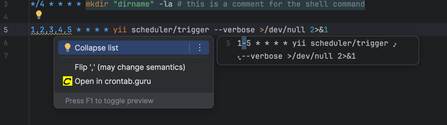

# Crontab

## Template ToDo list

<!-- Plugin description -->

[Github](https://github.com/j-plugins/crontab-plugin) | [Telegram](https://t.me/jb_plugins/2) | [Donation](https://github.com/xepozz/xepozz?tab=readme-ov-file#become-a-sponsor)

## Cron &amp; Crontab Support

Crontab syntax support:

- Schedule periods and errors highlighting
- Shell command completions
- Human-readable schedule folding
- Cron expression tester
- Cron expression injection
- Schedule grammar inspections
- [crontab.guru](https://crontab.guru) integration

## Donation

Open-source tools can greatly improve workflows, helping developers and businesses save time and increase revenue.
Many successful projects have been built on these tools, benefiting a wide community.
However, maintaining and enhancing these resources requires continuous effort and investment.

Support from the community helps keep these projects alive and ensures they remain useful for everyone.
Donations play a key role in sustaining and improving these open-source initiatives.

Chose the best option for you to say thank you:

[ Patreon](https://patreon.com/xepozz)
|
[ Buy me a coffee](https://buymeacoffee.com/xepozz)
|
[ Boosty](https://boosty.to/xepozz)

<!-- Plugin description end -->

## Screenshots

#### Basic usage

#### Intentions

#### Integrations

## Installation

- Using the IDE built-in plugin system:
  
  <kbd>Settings/Preferences</kbd> > <kbd>Plugins</kbd> > <kbd>Marketplace</kbd> > <kbd>Search for "crontab-plugin"</kbd> >
  <kbd>Install</kbd>
  
- Using JetBrains Marketplace:

  Go to [JetBrains Marketplace](https://plugins.jetbrains.com/plugin/MARKETPLACE_ID) and install it by clicking the <kbd>Install to ...</kbd> button in case your IDE is running.

  You can also download the [latest release](https://plugins.jetbrains.com/plugin/MARKETPLACE_ID/versions) from JetBrains Marketplace and install it manually using
  <kbd>Settings/Preferences</kbd> > <kbd>Plugins</kbd> > <kbd>⚙️</kbd> > <kbd>Install plugin from disk...</kbd>

- Manually:

  Download the [latest release](https://github.com/j-plugins/crontab-plugin/releases/latest) and install it manually
  using
  <kbd>Settings/Preferences</kbd> > <kbd>Plugins</kbd> > <kbd>⚙️</kbd> > <kbd>Install plugin from disk...</kbd>

---
Plugin based on the [IntelliJ Platform Plugin Template][template].

[template]: https://github.com/JetBrains/intellij-platform-plugin-template
[docs:plugin-description]: https://plugins.jetbrains.com/docs/intellij/plugin-user-experience.html#plugin-description-and-presentation
